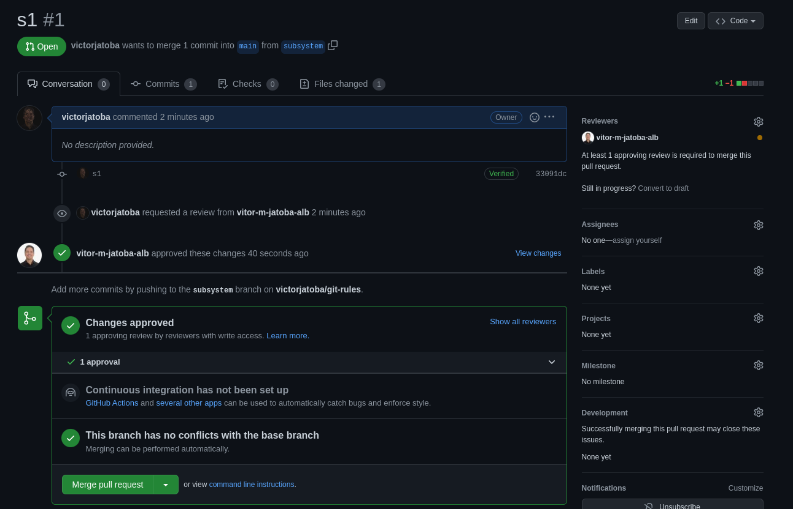
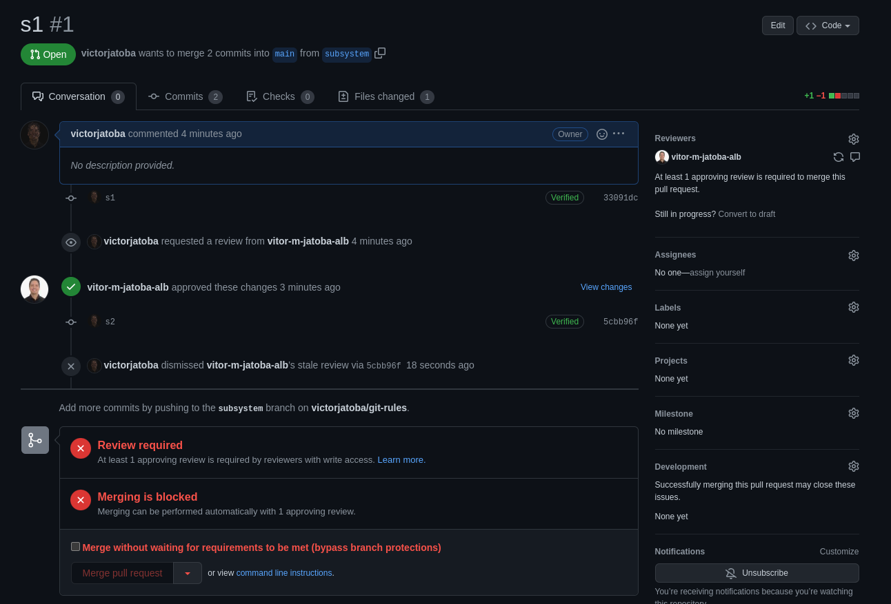

# Check Branch Protection Rules

Check how PRs works with checking the rules below:

## Rule 1

- [x] Require a pull request before merging
  - [x] Dismiss stale pull request approvals when new commits are pushed

- Criar PR com user A
- Aprovar PR com o user B



- Fazer commit


## Rule 2

- [x] Require status checks to pass before merging
  - [x] Require branches to be up to date before merging

- criar branch A
- Fazer commits na A
- Fazer PR
- Fazer commits na main

```fs
54e9e35 (HEAD -> main, origin/main, origin/HEAD) m3
874ed99 m2
223702a m1
cc6f032 Initial commit
```

- Após aprovar o PR

```fs
d0a9578 (HEAD -> main, origin/main, origin/HEAD) Merge pull request #1 from victorjatoba/subsystem
54e9e35 m3
25e3d12 (origin/subsystem) Merge branch 'main' into subsystem
874ed99 m2
223702a m1
5cbb96f (subsystem) s2
33091dc s1
cc6f032 Initial commit
```

Sugestões de mais marcações:

- Require conversation resolution before merging
- Require signed commits
